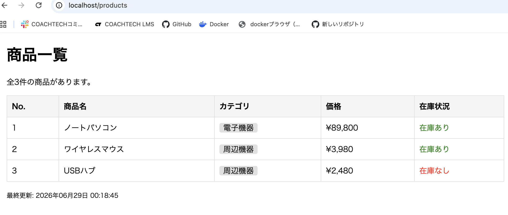

#blade-app-practice

## 概要
COACHTECH 教材 Tutorial 9-2「Bladeテンプレート ハンズオン演習」で作成した成果物です。
提供されたBladeファイルを元に、商品名、カテゴリー、価格、在庫状況、最終更新日を動的に表示する為のプログラムです。

## 使用技術
- PHP 8.x
- Laravel 10.x
- Blade テンプレート

## 学んだこと
laravelsailの環境構築。フロントエンドからbladeファイルを受け取った流れからのコントローラーやルーティングの作成と設定。bladeファイルの設置までの一連の接続作業を学びました。
動的なページの作成であるためコントローラーの作成が必須である事の再確認。

## 詰まったところ
コントローラーの作成コマンドを打つ際に、PCでの作業かコンテナ内かでコードが違うことに気づかず、AIでコードのチェックを行い問題点に気づき、修正を行なった。

http://localhost/products にアクセスし画面表示の確認の際ブラウザーにAttempt to read property"name"on　arrayのエラー表示が出た。AIにエラーを投げかけたところ該当箇所の構文ミスがあり修正後に解決した。（オブジェクトでなく連想配列になっていた）

現在時刻の表示が違っており、configフォルダより'timezone' => 'Asia/Tokyo',に変更。

## 動作確認
laravel環境下で指定のBladeファイルからコントローラー作成・ルーティングの設定を行い紐付けが完了したところで　http://localhost/products にアクセスし期待した画面表示が行われているかの確認を行った。
<!-- README.md からの書き方 -->

